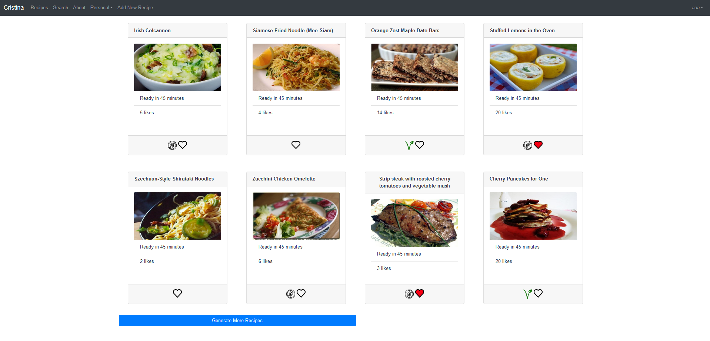
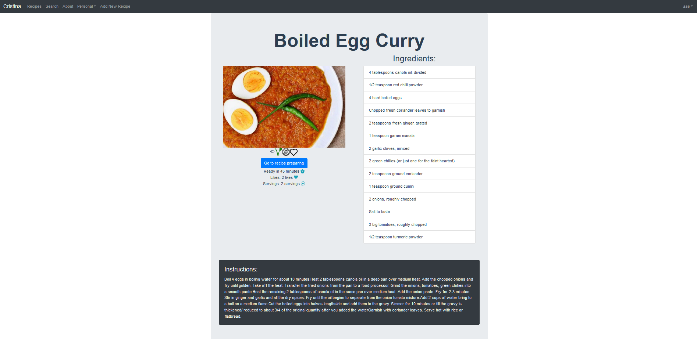
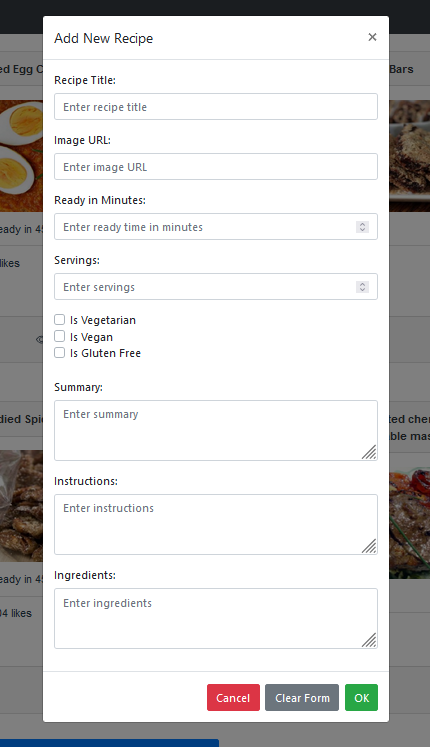

# Welcome to Chen's and Ofir's Website!

Chen Frydman 208009845  
Ofir Tamir 208897991

This Website was created for a project in the course 'Internet Programming Environments'.
This Website was created for a project in the course 'Internet Programming Environments'.

## Installation
In order to install the website, you are going to need:

### 1. Get the API key from spoonacular
Create a user in this [website](spoonacular.com) and get the API key from there

### 2. Install MySQL
Download MySQL server from this [website](https://dev.mysql.com/downloads/installer/). We used Version 8.0.39 on Windows machine.

### 3. Node.js
Download Node.js from [here](https://nodejs.org/en/download/prebuilt-installer). We used v20.17.0 (LTS) on Windows.

### 4. Create .env file 
Create the .env file in the main folder with the following information:

host = [your host name] 
user = [your user to the MySQL] 
password = [your password to the MySQL] 
database = [your database to the MySQL] 
VUE_APP_spooncular_apiKey = [your api key from spoonacular] 
PORT = 3000

### 5. Create the tables
Create the tables according to the [tables.txt](./txt_and_img_files/tables.txt)

### 6. Insert data into the tables
Run the commands to insert data in the familyrecipes table from [Family Recipes](./txt_and_img_files/Family%20Recipes.txt)

### 7. Run npm install
Run the command npm install in order to install everthing required

### 8. Run node main.js
Start the server running with the command 'node main.js' in the terminal.